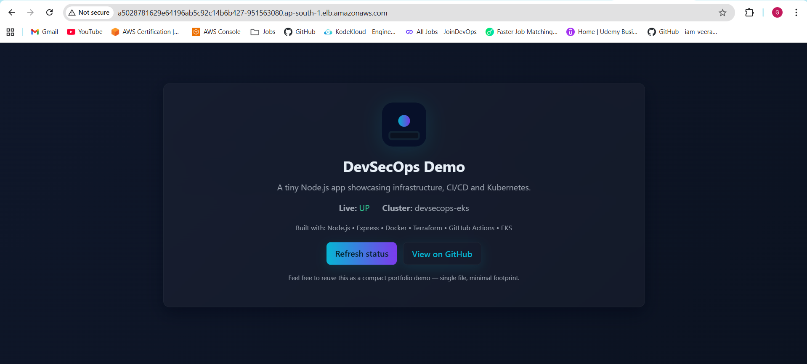
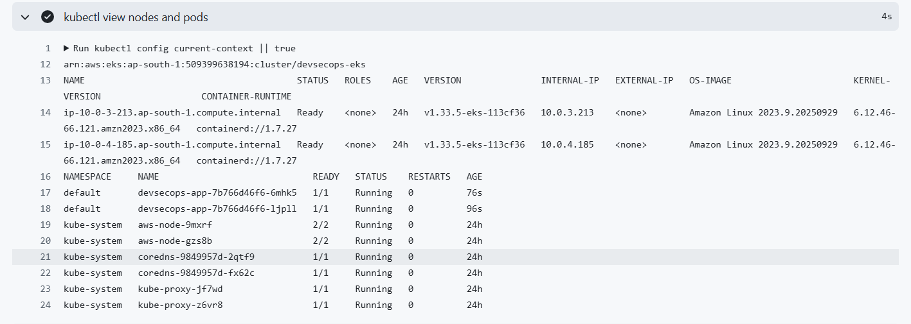
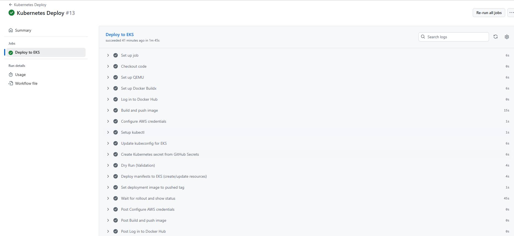

# DevSecOps EKS Project

A sample DevSecOps project that demonstrates provisioning an AWS EKS cluster with Terraform, packaging an Express app with Docker, and deploying via GitHub Actions.

This repository includes:

- Terraform configuration for VPC and EKS (under `infra/`).
- Kubernetes manifests (under `k8s/`) for Deployment, Service, ConfigMap and Secret template.
- A small Node.js Express app (under `app/`) with a simple SPA.
- GitHub Actions workflows for Terraform and Kubernetes deployment (`.github/workflows/`).
- Documentation and guidance (`docs/`).

---

## Quick start (local)

Prerequisites:

- Node.js (v18+)
- Docker (for container builds)
- kubectl (for interacting with the cluster)
- terraform (if you plan to provision infra)

### REPO STRUCTURE

```
devsecops-eval/
├── .github/
│   └── workflows/
│       ├── eks-diagnose.yml
│       ├── kubernetes-deploy.yml
│       └── terraform.yml
├── app/
│   ├── Dockerfile
|	│   ├── package.json
|	│   └── server.js
│   └── public/
│       ├── index.html
│       ├── app.js
│       └── styles.css
├── infra/
│   ├── main.tf
│   ├── variables.tf
│   ├── terraform.tf
│   ├── provider.tf
│   ├── terraform.tfvars
│   └── modules/
│       ├── vpc/
│       └── eks/
├── k8s/
│   ├── aws-auth.yaml
│   ├── configmap.yaml
│   ├── deployment.yaml
│   ├── secret.yaml
│   └── service.yaml
├── docs/
│   ├── SECRETS.md
│   └── (other docs and assets)
└── README.md
```

# 🚀 DevSecOps EKS Project

This project builds a full AWS EKS-based DevSecOps environment using Terraform, Docker, and GitHub Actions.

---

## 🧱 Architecture Overview

- AWS VPC (public/private subnets)
- EKS Cluster (with managed node groups)
- S3 backend for Terraform state
- Node.js + Express sample app
- CI/CD via GitHub Actions

---

## ⚙️ Setup Instructions

### 1️⃣ Clone the Repository

```bash
git clone https://github.com/<your-username>/devsecops-eval.git
cd devsecops-eval
```

###  Terraform (IaC) - Infra Provisioning:
 - VPC with 2 public and 2 private subnets
 - Internet Gateway + NAT Gateway
 - EKS Cluster + Node Group
 - S3 backend for state file

### 2️⃣ Deploy Infrastructure

```powershell
cd infra
terraform init
terraform apply -auto-approve
```

### 3️⃣ Deploy Application

Push to the main branch to trigger the Kubernetes workflow automatically. Alternatively, deploy manually:

```powershell
aws eks update-kubeconfig --region ap-south-1 --name devsecops-eks
kubectl apply -f k8s/
```

### 4️⃣ Access the App

Get the external load balancer URL:

```powershell
kubectl get svc devsecops-service
```

Then open in browser:
```powershell
http://<elb-dns-name>
```

### Validation Steps

- Run `kubectl get nodes` — shows Ready nodes
- Run `kubectl get pods` — shows running app pods
- Visit the ELB DNS — application accessible
- CI/CD pipelines should show “Success” on GitHub Actions

### 📸 Screenshots






### 🔒 Security Risks Identified
- Secrets stored as base64 in YAML
- Open inbound security group (0.0.0.0/0)
- No RBAC or pod security policy

### ✅ Mitigations & Future Improvements
- Migrate secrets to AWS Secrets Manager
- Restrict SG rules to known IPs
- Implement RBAC and IRSA for granular access
- Add network policies for pod-level isolation

## Author

👤 Gaurav Kothari

DevOps Engineer | AWS | Terraform | Kubernetes

📧 kotharigaurav22@gmail.com

https://www.linkedin.com/in/iamgauravkothari/